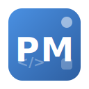

# Project Manager (ProMan)

<div align="center">



**A Project Manager made by a dev, for devs.**

[](https://www.gnu.org/licenses/gpl-3.0)
[](https://vala.dev)
[](https://gtk.org)
[](https://elementary.io)

</div>

## 📋 Description

ProMan is a lightweight, developer-focused project manager that helps you organize and quickly access your development projects. Built with Vala and GTK4, it integrates seamlessly with the elementary OS desktop environment while working perfectly on any Linux distribution.

### ✨ Features

- **📁 Project Management** - Add, edit, and delete projects with ease
- **🚀 Quick Launch** - Open projects in your file manager or terminal with one click
- **📊 Smart Sorting** - Projects are automatically sorted by last accessed time
- **🎨 Native Look & Feel** - Follows your system theme (light/dark mode support)
- **💾 Local Storage** - Projects are stored locally in JSON format
- **⚡ Fast & Lightweight** - Minimal resource usage, instant startup
- **🔧 Developer Friendly** - Built for developers, by developers

### 🗂️ Planned Features

- [ ] Custom commands (build, run, test)
- [ ] Project tags and categories
- [ ] Search and filtering
- [ ] Git integration
- [ ] Project templates
- [ ] Plugin system

## 📦 Installation

### From Source

```bash
# Clone the repository
git clone https://github.com/sheldi/ProMan.git
cd ProMan

# Install dependencies
sudo apt install valac meson libgtk-4-dev libgranite-7-dev libjson-glib-1.0-dev libgee-0.8-dev

# Build and install
meson setup build
cd build
ninja
sudo ninja install
sudo glib-compile-schemas /usr/local/share/glib-2.0/schemas/
```

### Dependencies

- Vala (>= 0.56)
- GTK4 (>= 4.0)
- Granite (>= 7.0)
- JSON-GLib (>= 1.0)
- Gee (>= 0.8)
- Meson (>= 0.60)

### Running Without Installation

```bash
meson setup build
cd build
ninja
./src/online.sheldi.proman
```

## 🚀 Usage

1. **Add a Project**: Click the `+` button in the header bar
2. **Enter Project Details**: Give your project a name and select its folder
3. **Open in File Manager**: Click the folder icon next to any project
4. **Open in Terminal**: Click the terminal icon to launch a terminal in the project directory
5. **Edit Project**: Click the edit (pencil) icon to modify project details
6. **Delete Project**: Click the trash icon to remove a project (confirmation optional in settings)
7. **Settings**: Click the gear icon to access preferences (dark mode, confirm delete, etc.)

### Keyboard Shortcuts

| Action | Shortcut |
|--------|----------|
| Add Project | `Ctrl + N` |
| Quit | `Ctrl + Q` |
| Settings | `Ctrl + ,` |

## 🎨 Screenshots

<div align="center">
  <!-- Add screenshots here once you have them -->
  <p><i>Screenshots coming soon!</i></p>
</div>

## 🛠️ Building from Source

### Development Dependencies

For development, you'll also need:

```bash
sudo apt install libglib2.0-dev-bin
```

### Building with Debug Symbols

```bash
meson setup build -Ddebug=true
cd build
ninja
```

### Running Tests

```bash
ninja test
```

## 📁 Project Structure

```
ProMan/
├── data/               # App metadata, desktop entry, icons
│   ├── icons/         # Application icons in multiple sizes
│   ├── *.desktop.in   # Desktop entry template
│   ├── *.metainfo.xml.in # AppStream metadata
│   └── *.gschema.xml  # GSettings schema
├── src/               # Source code
│   ├── Application.vala
│   ├── MainWindow.vala
│   ├── Project.vala
│   ├── ProjectManager.vala
│   ├── ProjectRow.vala
│   ├── NewProjectDialog.vala
│   ├── Settings.vala
│   ├── SettingsDialog.vala
│   └── Utils.vala
├── po/                # Translations (coming soon)
├── meson.build        # Build configuration
└── README.md
```

## 🤝 Contributing

Contributions are welcome! Here's how you can help:

1. **Report Bugs**: Open an issue on GitHub
2. **Suggest Features**: Share your ideas in the issues section
3. **Submit PRs**: Fork the repo and create a pull request
4. **Translate**: Help translate ProMan into your language

### Coding Standards

- Follow Vala best practices
- Use GTK4 and Granite widgets appropriately
- Maintain consistent indentation (2 spaces)
- Add comments for complex logic

## 📄 License

This project is licensed under the GNU General Public License v3.0 - see the [LICENSE](LICENSE) file for details.

## 👨‍💻 Author

**Sheldi** (or your name)

- GitHub: [@sheldi](https://github.com/sheldi)

## 🙏 Acknowledgments

- elementary OS team for Granite and HIG
- GTK team for the fantastic toolkit
- Vala language community

## ⭐ Support

If you find ProMan useful, please consider:
- Starring the repository on GitHub
- Sharing it with other developers
- Reporting bugs and suggesting improvements

---

<div align="center">
Made with ❤️ for developers everywhere
</div>
